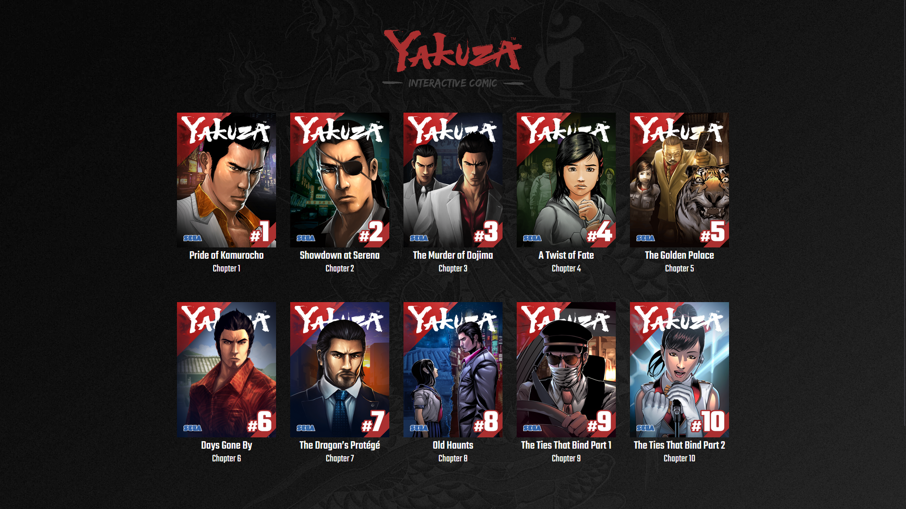

# The Dragon's Path Comic Restorer

  

- A tool that fixes errors in the Yakuza Experience site and lets you read the comic
- Fits all comic panels into single pages (instead of them being split into 8) for convenience
- Adds dark mode support and cleans up the design of the site
- Saves required sounds and images locally for 100% offline functionality

# Requirements

- Python 3, preferably added to the system PATH
- Basic file management, terminal and Python usage skills

# Setup and usage

1. Download the project repository
    - Click the green `<>Code` button and press `Download ZIP`
    - Extract the ZIP file in a directory of your choice
1. Obtain and put required files in the appropriate folders:
    - *Requires* putting a backed up copy of the website's files `data/experience`
        - Special thanks to KaiZettaSlow for dumping the [contents of the Yakuza Experience site](https://drive.google.com/file/d/1S4Pmcr5-kE0YFVCF-cSZP7eSobBEnxTH/view)!
        - `index.html` should be directly in the `experience` folder alongside files such as `comic-a-twist-of-fate-1`
    - *Optionally*,  put `edo-webfont.ttf` and `edo-webfont.woff` in the `data` folder
        - Not neccesary to view the comic and doesn't affect the comic itself, only fixes the appearance of some navigation buttons that use the Edo font
    - The final file structure should look something like this:
        ```
        📂data/
        |-- ! put required files here !
        |-- 📂experience/
        |   |--- 📂css/...
        |   |--- 📂js/...
        |   |--- index.html
        |   |--- comic
        |   |--- map
        |   |--- comic-a-twist-of-fate-1
        |   |--- comic-a-twist-of-fate-2
        |   |--- ...
        |-- edo-webfont.ttf
        |-- edo-webfont.woff
        ```
1. Edit the `config.py` configuration file to your liking:
    - Preparing assets for offline use may take a while. If you don't need that functionality, set the `local_resources` entry to `False`
    - Set `css_tweaks` to `False` if you want to view the site exactly as it used to look, without visual tweaks and improvements
    - You should leave other entries set to their default values, unless you know what you're doing
1. Open a terminal in the main project directory
    - On Windows 11, you can right click empty space in the folder and press `Open in Terminal`
    - On earlier versions of Windows, you can select File Explorer's address bar, typ `cmd` and press enter
1. Install required python packages with `pip install -r requirements.txt`
1. Run `python3 dp_restorer.py` to prepare files, apply fixes and launch the comic in your browser

# Notes and known issues

- This only fixes the comic, other features of the Experience site are still non-functional
- Sounds don't work consistently, sometimes you need to click around or mute and unmute to make them play
- If the site doesn't work straight away, refresh a couple of times
